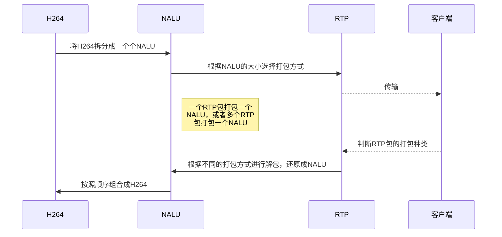

# 整体流程
H264由以一个个NALU为单位进行打包，根据NALU的大小选择打包成RTP的方式，然后传输RTP包给客户端，客户端判断打包的种类进行解包，还原成NALU，将NALU按顺序拼接成H264，解码，封装……


# H264与NALU
视频由图像组成，一个帧率为25的视频每秒钟有25张图像，一个视频图像编码后的数据叫做一帧。
一个H264帧由一些列NALU构成，每个NALU又被拆解为若干个数据段，这些数据段打上一个头后(这个头部有NALU分段的标识，start_bit和end_bit表示起始数据段和结束数据段)，再封装成rtp包去发送。传输同一个H264帧的rtp包都具有相同的时间戳[^1]。


[\[总结\]视音频编解码技术零基础学习方法](https://blog.csdn.net/leixiaohua1020/article/details/18893769)
[从零了解H264结构](http://www.iosxxx.com/blog/2017-08-09-从零了解H264结构.html "从零了解H264结构")
[入门理解H264编码](https://blog.csdn.net/go_str/article/details/80340564)

# RTP构成
一个RTP包由RTP头部和RTP payload[^2]构成。
下面是 RFC 3550 中规定的 RTP 头的结构：
```
       0             1               2               3               4
       0 1 2 3 4 5 6 7 0 1 2 3 4 5 6 7 0 1 2 3 4 5 6 7 0 1 2 3 4 5 6 7
      +-+-+-+-+-+-+-+-+-+-+-+-+-+-+-+-+-+-+-+-+-+-+-+-+-+-+-+-+-+-+-+-+
      |V=2|P|X|  CC   |M|     PT      |       sequence number         |
      +-+-+-+-+-+-+-+-+-+-+-+-+-+-+-+-+-+-+-+-+-+-+-+-+-+-+-+-+-+-+-+-+
      |                           timestamp                           |
      +-+-+-+-+-+-+-+-+-+-+-+-+-+-+-+-+-+-+-+-+-+-+-+-+-+-+-+-+-+-+-+-+
      |           synchronization source (SSRC) identifier            |
      +=+=+=+=+=+=+=+=+=+=+=+=+=+=+=+=+=+=+=+=+=+=+=+=+=+=+=+=+=+=+=+-+
      |            contributing source (CSRC) identifiers             |
      |                             ....                              |
      +-+-+-+-+-+-+-+-+-+-+-+-+-+-+-+-+-+-+-+-+-+-+-+-+-+-+-+-+-+-+-+-+
```
RTP协议头部共12字节，在每一个RTP packet中都会存在，头部之后就是RTP payload部分，也即是H264数据；由于NALU数据打包进入RTP packet时会把start code[^3]（00 00 00 01 或者00 00 01）去掉，所以RTP payload部分第一字节就是H264 NALU Header部分；

[RTP（实时传输协议）](https://www.cnblogs.com/qingquan/archive/2011/07/28/2120440.html)

# RTP打包H264的方式

## 单一 NAL 单元模式
即一个 RTP 包仅由一个完整的 NALU 组成。这种情况下 RTP NAL 头类型字段和原始的H.264的NALU 头类型字段是一样的。

对于 NALU的长度小于 MTU [^4]大小的包，一般采用单一 NAL 单元模式。


NALU 头仅一个字节，其后都是 NALU 单元内容。打包时去除 "00 00 01" 或"00 00 00 01" 的开始码，把其他数据封包的 RTP 包即可，有如下例子：

```
[00 0000 01 67 42 A0 1E 23 56 0E 2F ... ] 

封装成 RTP 包将如下：

[ RTPHeader ] [ 67 42 A0 1E 23 56 0E 2F… ]
```
##  组合封包模式
当 NALU 的长度特别小时, 可以把几个 NALU 单元封在一个 RTP 包中（一般不用）

## FU-A的分片格式
数据比较大的H264视频包，被RTP分片发送。12字节的RTP头后面跟随的就是FU-A分片。

[H264 over RTP 的打包](https://blog.csdn.net/u010178611/article/details/82592393)
[基于RTP的H264视频数据打包解包类](https://blog.csdn.net/gokartscomeon/article/details/44408295)
[H264视频传输、编解码----RTP协议对H264数据帧拆包、打包、解包过程](https://blog.csdn.net/wujian946110509/article/details/79129338)

# RTP解包H264的原理
跟打包相反，原理就是从udp接收一个数据包，判断这个数据包是单个发送还是分片发送，进而获取rtp包中的h264NAL数据，并加上0x00000001起始字节一并写进文件中即可。因此接收到只需要将接收到的RTP包组装成NALU，然后将NALU连接起来就可以还原H264帧了，由于网络传输可能会丢包和乱序，所以接收端还要有RTP接收缓存，用于RTP包排序（根据RTP头的SN[^5]进行排序）。

[H264 over RTP 的解包](https://blog.csdn.net/u010178611/article/details/82625891)
[RTP 协议解包为 H264 裸流](https://blog.csdn.net/pang_gua/article/details/86599782)
[h264_rtp打包解包类及实现demo](https://www.cnblogs.com/jingzhishen/p/9363578.html)

# H264编解码与封装
使用x264编码
使用第三方库解码与封装
# 第三方库
## FFmpeg
[ffmpeg下载](http://ffmpeg.org/download.html)
[\[总结\]FFMPEG视音频编解码零基础学习方法](https://blog.csdn.net/leixiaohua1020/article/details/15811977)
[最简单的基于FFMPEG+SDL的视频播放器 ver2 （采用SDL2.0）](https://blog.csdn.net/leixiaohua1020/article/details/38868499)
[H264码流封装MP4](https://blog.csdn.net/qq_28086637/article/details/51201594)
[ffmpeg 读取 rtsp](https://blog.csdn.net/cjqqschoolqq/article/details/88976112)
## mp4v2
[mp4v2下载](http://packages.macports.org/mp4v2/)
## libvlc(vlc-qt)
[libvlc下载](http://download.videolan.org/pub/videolan/vlc/)
[C++使用VLC播放视频](https://blog.csdn.net/dong923700243/article/details/85711011)
[最简单的基于libVLC的视频播放器](https://blog.csdn.net/leixiaohua1020/article/details/42363079)
[最简单的基于libVLC的推流器](https://blog.csdn.net/leixiaohua1020/article/details/42363701)
[VLC-Qt 入门指南](https://www.cnblogs.com/lvdongjie/p/9805214.html)
[VLC和Qt结合编写流媒体rtsp播放器](https://www.cnblogs.com/lvdongjie/p/9829030.html)
[^1]:**时间戳**：32比特，记录了该包中数据的第一个字节的采样时刻。在一次会话开始时，时间戳初始化成一个初始值。即使在没有信号发送时，时间戳的数值也要随时间而不断地增加（时间在流逝嘛）。时间戳是去除抖动和实现同步不可缺少的。
`时间戳 = 上一次时间戳 + 采样频率（典型值为90000）*0.000001 * 两帧时间差（单位毫秒）来计算的`

[^2]:**净荷（Payload）**：一般是指一组协议中除去消息头以外的信息，即有效信息。

[^3]:**StartCode**：对于一个原始的H.264 NALU 单元常由 `[StartCode] [NALU Header] [NALU Payload]` 三部分组成，其中 Start Code 用于标示这是一个NALU 单元的开始，必须是"00 00 00 01" 或"00 00 01"，H264编码是以二进制进行存储的，以"00 00 00 01" 或"00 00 01"来分割NALU，即：
`00 00 00 01 [NALU1 Header] [NALU1 Payload] 00 00 00 01 [NALU2 Header] [NALU2 Payload] 00 00 00 01 ……`

[^4]:**MTU（Maximum Transmission Unit，MTU）**：最大传输单元，是指一种通信协议的某一层上面所能通过的最大数据报大小（以字节为单位）。最大传输单元这个参数通常与通信接口有关（网络接口卡、串口等）。

[^5]:**序列号（SN）**：16比特，发送方在每发送完一个RTP包后就将该域的值增加1，接收方可以由该域检测包的丢失及恢复包序列。序列号的初始值是随机的。
<!--stackedit_data:
eyJoaXN0b3J5IjpbOTY0NzIxNDE1XX0=
-->